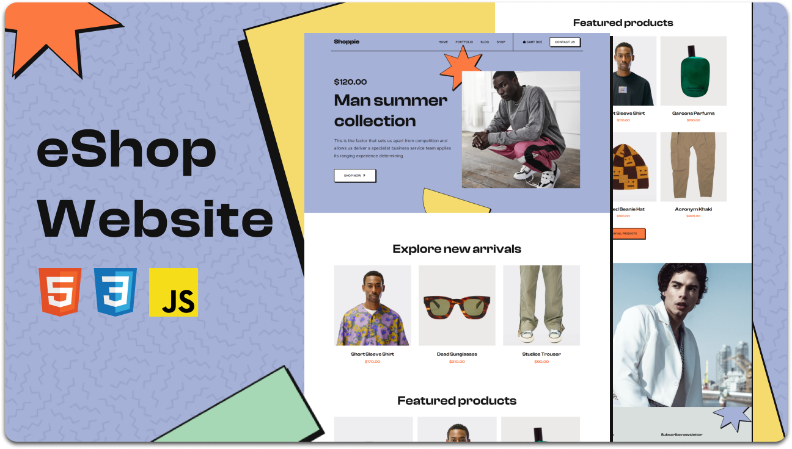

  

   
   

  <h2 align="center">Shoppie - eCommerce Website</h2>

  Shoppie is a fully responsive ecommerce website,  Responsive for all devices, built using HTML, CSS, and JavaScript.

  <a href="https://mens-collection-indol.vercel.app/"><strong>➥ Live Demo (Vercel)</strong></a>

 

### Demo Screenshots

### Project Overview

Shoppie is a modern, fully responsive ecommerce website designed to provide a seamless shopping experience across all devices. It features a clean and user-friendly interface built with HTML, CSS, and JavaScript, making it easy to customize and extend.

### Features

- Fully responsive design for desktop, tablet, and mobile devices
- Product listing with images and descriptions
- Interactive UI elements powered by JavaScript
- Easy to customize and extend
- Lightweight and fast loading

### Technologies Used

- HTML5
- CSS3
- JavaScript (ES6+)

### Deployment

This project is deployed and hosted on Vercel. You can access the live version here:  
[https://mens-collection-indol.vercel.app/](https://mens-collection-indol.vercel.app/)

### Contact

If you want to contact with me you can reach me at [Email](brianmwasbayo@gmail.com).

### License

This project is open source
